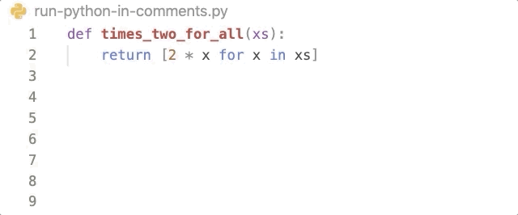
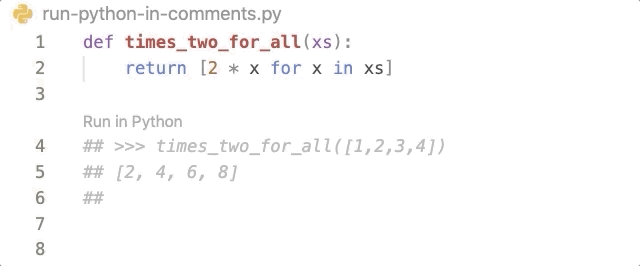

# Python-Inline-Repl

Inspired by the inline-repl feature from [Simple GHC (Haskell) Integration for VSCode](https://github.com/dramforever/vscode-ghc-simple), the extension python-inline-repl
can run Python codes within comments and preserve the result in your file.

## Features

You can use variables and functions defined in your file.

You can re-run the code after modification to overwrite the result.

You can write the spec for a function using examples.

## Usage

Just enabel the extension and open a Python file!

**Enjoy!**
